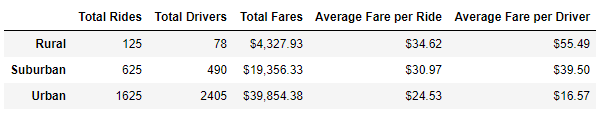
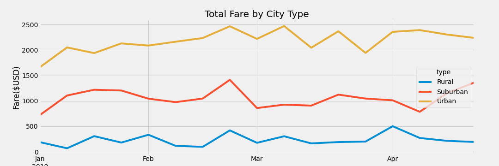

# PyBer_Analysis

## Overview:
### Purpose: 
The purpose of this week’s module is to create a summary DataFrame out of the ‘PyBer’ ride-sharing data by city type. Then, using Pandas and Matplotlib, I created a multiple-line graph that shows the total weekly fares for each city type. 
### Method:
I began with two csv files provided by ‘PyBer’ for ride data and city data. Cities were classified as belonging to one of three buckets: urban, suburban, or rural. 
## Results: 
An initial look at the data shows us that only 5% of rides taken with the PyBer service are rural, as opposed to 27% suburban, and 68% for urban cities. There are also almost 30x more drivers in urban settings than in rural communities. However, rural communities account for 7% of total fares, 30% suburban, and 62% for urban. This can be explained by the
fact that our data shows that rural rides are more expensive to take, averaging $10 more than urban rides. 

These differences stay mostly consistent between city types, as you can see in the Total Fare by City Type chart below. 

## Summary: 
### Recommendation:
There should be some analysis done on how rides are charged depending on city type. Given that rides given in rural cities generate a larger percentage of fare revenue that their percentage of total rides given, I can intimate that the algorithm may be based on distance. I would recommend three possible steps to increase revenue:
1.	Modify the algorithm to account for factors other than distance, such as time, to increase the cost per ride in urban and suburban cities. 
2.	Increase advertising for both driver recruitment and rider interest in suburban and rural cities to grow the user base. 
3.	It would be helpful to analyze a larger portion of PyBer’s data to better understand trends and other contributing factors to ride data, such as season.
